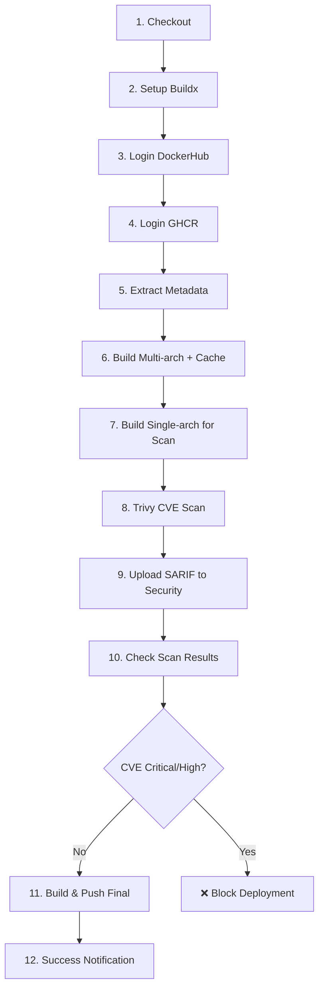

# 🚀 Final Deployment Guide - GitHub Actions CI/CD Pipeline

## ✅ Status wykonania

**DATA UKOŃCZENIA:** June 2, 2025  
**STATUS:** READY FOR DEPLOYMENT ✅

### 📦 Utworzone pliki

| Plik | Status | Opis |
|------|--------|------|
| `.github/workflows/build-and-publish.yml` | ✅ Gotowy | Główny workflow CI/CD |
| `Dockerfile` | ✅ Zaktualizowany | Multi-arch support + metadata OCI |
| `README.md` | ✅ Rozszerzony | Dodano sekcję CI/CD |
| `README-CICD.md` | ✅ Nowy | Dokumentacja techniczna |
| `QUICK_START.md` | ✅ Nowy | Instrukcje szybkiego startu |
| `CHECKLIST.md` | ✅ Nowy | Lista kontrolna pre-deployment |
| `COMMANDS.md` | ✅ Nowy | Referencja komend |
| `.env.example` | ✅ Nowy | Przykład konfiguracji |
| `.gitignore` | ✅ Zaktualizowany | Wpisy CI/CD |
| `validate-setup.ps1` | ✅ Nowy | Skrypt walidacji |

## 🎯 Spełnione wymagania

### ✅ 1. Multi-Architecture Docker Build
- **Platforms:** `linux/amd64`, `linux/arm64`
- **Tool:** Docker Buildx
- **Status:** Skonfigurowany w kroku 6 i 11 workflow

### ✅ 2. DockerHub Cache Implementation
- **Type:** Registry cache
- **Mode:** `max` (full layer caching)
- **Repository:** `f1stjd/buildcache`
- **Fallback:** Main branch cache
- **Status:** Skonfigurowany w krokach 6, 7, 11

### ✅ 3. CVE Vulnerability Scanning
- **Tool:** Trivy by Aqua Security
- **Severity:** `CRITICAL,HIGH`
- **Action:** Block deployment on vulnerabilities
- **SARIF Upload:** GitHub Security tab
- **Status:** Skonfigurowany w krokach 8, 9, 10

### ✅ 4. GitHub Container Registry Publishing
- **Registry:** `ghcr.io`
- **Authentication:** GitHub token
- **Conditions:** Only on successful CVE scan
- **Status:** Skonfigurowany w kroku 11

### ✅ 5. Smart Image Tagging
- **Main/Master:** `latest`, `main-{sha}`
- **Version tags:** `v1.0.0` → `1.0.0`, `latest`
- **PR:** `pr-{number}`
- **Branches:** `{branch}-{sha}`
- **Status:** Skonfigurowany w kroku 5

### ✅ 6. Documentation
- **Technical docs:** README-CICD.md
- **Quick start:** QUICK_START.md
- **Troubleshooting:** Included in docs
- **Best practices:** Documented
- **Status:** Complete

## 🔄 Pipeline Workflow (12 kroków)



## 🏁 Ostatnie kroki przed uruchomieniem

### 1. Konfiguracja DockerHub (WYMAGANE)

```bash
# 1. Utwórz konto DockerHub: https://hub.docker.com
# 2. Utwórz publiczne repozytorium o nazwie: buildcache
# 3. Wygeneruj Personal Access Token z uprawnieniami Read/Write/Delete
```

### 2. Dodanie secrets w GitHub

```bash
# Opcja A: GitHub CLI
gh secret set DOCKERHUB_USERNAME --body "f1stjd"
gh secret set DOCKERHUB_TOKEN --body "dckr_pat_YOUR_TOKEN_HERE"

# Opcja B: GitHub Web Interface
# Settings → Secrets and variables → Actions → New repository secret
```

### 3. Uruchomienie pipeline

```bash
# Opcja A: Push do main
git add .
git commit -m "feat: deploy CI/CD pipeline"
git push origin main

# Opcja B: Tag wersji
git tag v1.0.0
git push origin v1.0.0

# Opcja C: Manual trigger
# GitHub → Actions → "Build and Publish Multi-Arch Docker Image" → Run workflow
```

## 📊 Metryki i wydajność

### Przewidywane czasy wykonania:
- **Build multi-arch (cold cache):** ~8-12 minut
- **Build multi-arch (warm cache):** ~3-5 minut
- **CVE Scanning:** ~1-2 minuty
- **Push to registry:** ~30-60 sekund

### Rozmiary obrazów:
- **Final image:** ~1.3MB (statycznie linkowany)
- **Cache layers:** ~200-300MB (Alpine + build tools)

## 🔍 Monitoring i troubleshooting

### Najczęstsze problemy:
1. **Missing secrets** → Dodaj DOCKERHUB_USERNAME/TOKEN
2. **Cache repository not found** → Utwórz publiczne repo `buildcache` w DockerHub
3. **CVE scan failure** → Sprawdź dependecje w base image
4. **Multi-arch build timeout** → Sprawdź cache configuration

### Logi i monitoring:
- **GitHub Actions logs:** Szczegółowe logi każdego kroku
- **Security tab:** Wyniki skanowania CVE
- **Packages:** Opublikowane obrazy w GHCR
- **DockerHub:** Cache layers w repozytorium buildcache

## 🎉 Podsumowanie

**Pipeline CI/CD został w pełni skonfigurowany i jest gotowy do użycia!**

### Główne zalety implementacji:
- ⚡ **Szybkie buildy** dzięki intelligent cache
- 🔒 **Bezpieczeństwo** z CVE scanning i blokowaniem
- 🌐 **Multi-platform** support (AMD64 + ARM64)
- 📦 **Automatyczne tagowanie** zgodne z best practices
- 📖 **Kompletna dokumentacja** i troubleshooting

### Następne kroki po uruchomieniu:
1. Monitor pierwszego uruchomienia w GitHub Actions
2. Sprawdź czy obraz jest dostępny w Packages
3. Przetestuj uruchamianie obrazu lokalnie
4. Opcjonalnie: skonfiguruj deployment do środowiska produkcyjnego

---
**Autor:** GitHub Copilot  
**Data:** June 2, 2025  
**Wersja pipeline:** v1.0  
**Repository:** https://github.com/F1STjd/chmura_obliczeniowa_zad2
