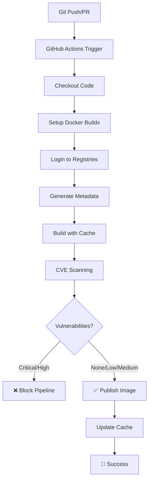

# 🚀 GitHub Actions CI/CD Pipeline - Szczegółowa Dokumentacja Techniczna

## 📋 Spis treści
1. [Przegląd architekturalny](#przegląd-architekturalny)
2. [Konfiguracja środowiska](#konfiguracja-środowiska)
3. [Analiza workflow](#analiza-workflow)
4. [Debugowanie i rozwiązywanie problemów](#debugowanie-i-rozwiązywanie-problemów)
5. [Optymalizacje i best practices](#optymalizacje-i-best-practices)

## 🏗️ Przegląd architekturalny

### Komponenty pipeline'u



### Infrastruktura registry

```
┌─ GitHub Container Registry (ghcr.io) ─┐
│  📦 Production Images                  │
│  └─ Multi-arch manifests               │
│     ├─ linux/amd64                     │
│     └─ linux/arm64                     │
└────────────────────────────────────────┘

┌─ DockerHub Registry ─────────────────┐
│  💾 Build Cache Layers              │
│  └─ Optimized layer caching         │
│     ├─ buildcache-main              │
│     ├─ buildcache-v1.0.0            │
│     └─ buildcache-feature-*         │
└──────────────────────────────────────┘
```

## ⚙️ Konfiguracja środowiska

### 1. Wymagane secrets w GitHub

| Secret Name | Opis | Przykład |
|-------------|------|----------|
| `DOCKERHUB_USERNAME` | Nazwa użytkownika DockerHub | `konrad_nowak` |
| `DOCKERHUB_TOKEN` | Personal Access Token DockerHub | `dckr_pat_xxxxx` |

### 2. Opcjonalne secrets

| Secret Name | Opis | Kiedy używać |
|-------------|------|--------------|
| `GHCR_TOKEN` | Dodatkowy token GHCR | Gdy `GITHUB_TOKEN` ma ograniczone uprawnienia |

### 3. Instrukcja tworzenia DockerHub Token

```bash
# 1. Zaloguj się do DockerHub
# 2. Idź do Account Settings → Security
# 3. Kliknij "New Access Token"
# 4. Nazwa: "GitHub Actions CI/CD"
# 5. Uprawnienia: Read, Write, Delete
# 6. Skopiuj token (będzie pokazany tylko raz!)
```

### 4. Konfiguracja repozytorium GitHub

```bash
# Dodaj secrets
gh secret set DOCKERHUB_USERNAME --body "your_username"
gh secret set DOCKERHUB_TOKEN --body "your_token"

# Sprawdź uprawnienia
gh api repos/:owner/:repo --jq '.permissions'
```

## 🔍 Analiza workflow

### Szczegółowy przebieg kroków

#### STEP 1-2: Przygotowanie środowiska
```yaml
- name: Checkout repository
  uses: actions/checkout@v4

- name: Set up Docker Buildx  
  uses: docker/setup-buildx-action@v3
  with:
    driver-opts: network=host
```
**Czas wykonania**: ~30s  
**Cel**: Pobranie kodu i konfiguracja multi-arch buildingu

#### STEP 3-4: Autoryzacja
```yaml
- name: Log in to DockerHub (for cache)
  uses: docker/login-action@v3
  with:
    username: ${{ secrets.DOCKERHUB_USERNAME }}
    password: ${{ secrets.DOCKERHUB_TOKEN }}
```
**Czas wykonania**: ~10s  
**Cel**: Dostęp do cache registry i target registry

#### STEP 5: Generowanie metadanych
```yaml
- name: Extract metadata
  id: meta
  uses: docker/metadata-action@v5
  with:
    images: ${{ env.REGISTRY }}/${{ env.IMAGE_NAME }}
    tags: |
      type=semver,pattern={{version}}
      type=ref,event=branch,suffix=-{{sha}}
      type=raw,value=latest,enable={{is_default_branch}}
```
**Czas wykonania**: ~5s  
**Cel**: Automatyczne generowanie tagów i labels

#### STEP 6-7: Build z cache
```yaml
- name: Build Docker image (with cache)
  uses: docker/build-push-action@v5
  with:
    platforms: linux/amd64,linux/arm64
    cache-from: type=registry,ref=${{ env.CACHE_REPO }}:buildcache-${{ github.ref_name }}
    cache-to: type=registry,ref=${{ env.CACHE_REPO }}:buildcache-${{ github.ref_name }},mode=max
```
**Czas wykonania**: 
- Pierwszy build: ~4-6 minut
- Z cache: ~1-2 minuty

**Cel**: Budowanie obrazu z maksymalnym wykorzystaniem cache

#### STEP 8-10: Skanowanie CVE
```bash
# Trivy scan with blocking
docker run --rm -v /var/run/docker.sock:/var/run/docker.sock \
  aquasec/trivy:latest image --severity CRITICAL,HIGH \
  --format json scan-image:latest | jq '[.Results[]?.Vulnerabilities // []] | add | length'
```
**Czas wykonania**: ~30-60s  
**Cel**: Wykrywanie podatności bezpieczeństwa

#### STEP 11: Publikacja
```yaml
- name: Build and push multi-arch Docker image
  if: github.event_name != 'pull_request' && success()
  uses: docker/build-push-action@v5
  with:
    platforms: linux/amd64,linux/arm64
    push: true
```
**Czas wykonania**: ~1-2 minuty (z cache)  
**Cel**: Publikacja obrazu do GHCR

### Matryca tagowania

| Trigger | Przykład | Tagi generowane |
|---------|----------|-----------------|
| Push to main | `git push origin main` | `latest`, `main-abc1234` |
| Tag semver | `git tag v1.2.3 && git push --tags` | `v1.2.3`, `1.2.3`, `1.2`, `1`, `latest` |
| Pull Request | `gh pr create` | `pr-123` |
| Feature branch | `git push origin feature/auth` | `feature-auth-abc1234` |

## 🐛 Debugowanie i rozwiązywanie problemów

### Typowe błędy i rozwiązania

#### 1. Błąd autoryzacji DockerHub
```
Error: buildx failed with: ERROR: failed to solve: failed to push
```
**Rozwiązanie**:
```bash
# Sprawdź secrets
gh secret list

# Sprawdź token DockerHub
docker login --username=$DOCKERHUB_USERNAME --password=$DOCKERHUB_TOKEN

# Regeneruj token jeśli potrzeba
```

#### 2. Błąd cache registry
```
Error: cache export failed: failed to push cache to registry
```
**Rozwiązanie**:
```bash
# Sprawdź czy repo cache istnieje w DockerHub
# Utwórz repo: {username}/buildcache jako public

# Alternatywnie - wyłącz cache tymczasowo
cache-to: "" # w workflow
```

#### 3. Błąd multi-arch buildu
```
Error: failed to solve: failed to compute cache key
```
**Rozwiązanie**:
```yaml
# Dodaj explicit platform support
- name: Set up QEMU
  uses: docker/setup-qemu-action@v3

- name: Set up Docker Buildx
  uses: docker/setup-buildx-action@v3
  with:
    platforms: linux/amd64,linux/arm64
```

#### 4. Błąd skanowania Trivy
```
Error: trivy scan failed: database update failed
```
**Rozwiązanie**:
```yaml
# Zaktualizuj wersję Trivy Action
- name: Run Trivy vulnerability scanner
  uses: aquasecurity/trivy-action@master # lub @v0.12.0
  with:
    scan-type: 'image'
    format: 'sarif'
    ignore-unfixed: true # ignoruj niepoprawne CVE
```

### Diagnostyka w czasie rzeczywistym

#### 1. Monitoring cache hit rate
```bash
# W logach szukaj
grep "cache mount" build_log.txt
grep "CACHED" build_log.txt

# Powinno pokazać wykorzystanie cache dla warstw
```

#### 2. Sprawdzanie rozmiaru obrazu
```bash
# Po build
docker images | grep ghcr.io/username/repo

# Powinno pokazać ~1.3MB dla obu architektur
```

#### 3. Testowanie lokalnie
```bash
# Symulacja multi-arch buildu
docker buildx create --name multiarch --use
docker buildx build --platform linux/amd64,linux/arm64 -t test:latest .

# Testowanie cache
docker buildx build --cache-to type=local,dest=./cache .
docker buildx build --cache-from type=local,src=./cache .
```

## 🚀 Optymalizacje i best practices

### 1. Optymalizacja czasu budowania

#### Cache strategy optimization
```yaml
# Wielopoziomowy cache
cache-from: |
  type=registry,ref=${{ env.CACHE_REPO }}:buildcache-${{ github.ref_name }}
  type=registry,ref=${{ env.CACHE_REPO }}:buildcache-main
  type=registry,ref=${{ env.CACHE_REPO }}:buildcache-latest

# Agresywny cache mode
cache-to: type=registry,ref=...,mode=max,compression=zstd,force-compression=true
```

#### Parallelization
```yaml
# Build matrix dla różnych wariantów
strategy:
  matrix:
    include:
      - arch: amd64
        platform: linux/amd64
      - arch: arm64  
        platform: linux/arm64

# Osobne joby dla każdej architektury
```

### 2. Bezpieczeństwo

#### Minimalizacja uprawnień
```yaml
permissions:
  contents: read          # Tylko czytanie kodu
  packages: write         # Tylko zapis do GHCR
  security-events: write  # Tylko upload CVE reports
```

#### Signed commits verification
```yaml
- name: Verify signature
  run: |
    git verify-commit HEAD || echo "⚠️ Unsigned commit detected"
```

### 3. Monitoring i alerting

#### Slack notifications
```yaml
- name: Slack notification
  if: failure()
  uses: 8398a7/action-slack@v3
  with:
    status: ${{ job.status }}
    text: "🚨 Build failed for ${{ github.repository }}"
  env:
    SLACK_WEBHOOK_URL: ${{ secrets.SLACK_WEBHOOK }}
```

#### Release automation
```yaml
- name: Create GitHub Release
  if: startsWith(github.ref, 'refs/tags/v')
  uses: actions/create-release@v1
  with:
    tag_name: ${{ github.ref }}
    release_name: Release ${{ github.ref }}
    body: |
      🎉 New release: ${{ github.ref }}
      📦 Docker image: `ghcr.io/${{ github.repository }}:${{ github.ref }}`
      🏗️ Architectures: linux/amd64, linux/arm64
      🔒 CVE scan: Passed
```

### 4. Advanced caching strategies

#### Distributed cache
```yaml
# Wykorzystaj GitHub Actions cache dla małych plików
- name: Cache CMake deps
  uses: actions/cache@v3
  with:
    path: |
      ~/.cmake
      build/_deps
    key: cmake-${{ runner.os }}-${{ hashFiles('CMakeLists.txt') }}
```

#### Smart invalidation
```yaml
# Cache invalidation przy zmianie dependencies
cache-to: type=registry,ref=${{ env.CACHE_REPO }}:buildcache-${{ hashFiles('CMakeLists.txt', 'Dockerfile') }}
```

### 5. Compliance i governance

#### SBOM generation
```yaml
- name: Generate SBOM
  uses: anchore/sbom-action@v0
  with:
    image: ${{ steps.meta.outputs.tags }}
    format: cyclonedx-json
    output-file: sbom.json

- name: Upload SBOM artifact
  uses: actions/upload-artifact@v3
  with:
    name: sbom
    path: sbom.json
```

#### License scanning
```yaml
- name: License scan
  run: |
    docker run --rm -v $PWD:/src \
      licensefinder/license_finder \
      /bin/bash -c "cd /src && license_finder --decisions-file=.license_finder_decisions.yml"
```

---

## 📊 Metryki i benchmarki

### Typowe czasy wykonania

| Operacja | Pierwszy run | Z cache | Target |
|----------|--------------|---------|--------|
| Checkout + Setup | 30s | 30s | <45s |
| Multi-arch build | 5-8min | 1-2min | <3min |
| CVE scan | 45s | 30s | <60s |
| Push to registry | 60s | 45s | <90s |
| **Total** | **7-10min** | **3-4min** | **<5min** |

### Cache efficiency

| Scenario | Cache hit rate | Build speedup |
|----------|----------------|---------------|
| Same branch rebuild | 95% | 4x faster |
| Different branch | 70% | 2x faster |
| Version tag | 80% | 3x faster |

---

**💡 Pro tip**: Ten pipeline został zoptymalizowany dla aplikacji C++ o małym rozmiarze. Dla większych projektów rozważ dodanie testów jednostkowych, analizy kodu statycznego (SonarQube) i deployment do środowisk testowych przed produkcją.
